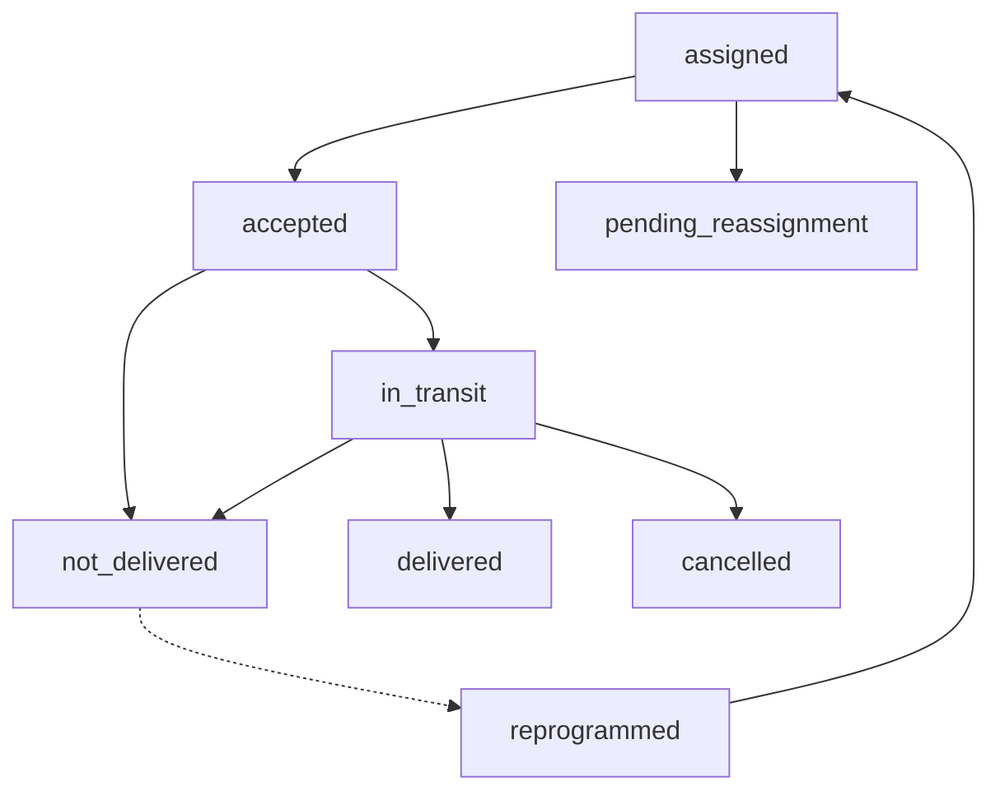

Each delivery in SansiStore passes through a strictly enforced sequence of statuses. The allowed transitions are defined in `deliveryStatusFlow.ts` and validated both client-side and server-side before any Firestore write. The full detail view for an individual delivery lives at `/delivery/order/[orderId]`, rendered by the `DeliveryOrderDetailPage` component with a `RouteGuard` that restricts access to the `mensajero` role.

## Status flow diagram



The primary happy-path route is:

```
assigned → accepted → in_transit → delivered
```

Alternative routes handle failures and exceptions:

```
assigned → pending_reassignment       (courier rejects the order)
accepted → not_delivered              (courier cannot reach customer)
in_transit → not_delivered            (delivery attempt fails en route)
in_transit → cancelled                (customer refuses to pay)
not_delivered → reprogrammed → assigned  (rescheduled for a new date)
```

## Status reference

<Accordion title="assigned — order waiting for acceptance">
  The delivery document exists and `courierId` is set, but the courier has not yet confirmed they will take it. The order appears in the **Pedidos asignados** section of the `MessengerDashboard`.

  **Triggered by:** Admin assigning an order to a courier in the admin panel.

  **Allowed next statuses:** `accepted`, `pending_reassignment`.

  **Important:** `assigned` status does **not** block the courier from accepting other orders — only `accepted` and `in_transit` count as active deliveries. A courier can have multiple `assigned` deliveries visible at the same time.
</Accordion>

<Accordion title="accepted — courier has taken the order">
  The courier confirmed they will deliver this order. From this point the courier is considered **busy** and cannot accept another delivery until this one is resolved.

  **Triggered by:** `acceptMessengerOrder` — requires the server-side eligibility check to pass first. Records `updatedAt` on the delivery document.

  **Allowed next statuses:** `in_transit`, `not_delivered`.

  **UI action:** Tapping **Aceptar pedido** on an assigned order card and confirming the `ConfirmAssignedOrderActionModal` dialog.
</Accordion>

<Accordion title="in_transit — courier is on the way">
  The courier has picked up the package and is en route to the customer. The delivery detail page (`/delivery/order/{orderId}`) is the primary workspace from this point.

  **Triggered by:** `setMessengerOrderStatus(order, 'in_transit')` — also writes `inTransitAt` to the delivery document.

  **Allowed next statuses:** `delivered`, `not_delivered`, `cancelled`.

  **UI action:** Tapping **Iniciar entrega** on the delivery detail page.
</Accordion>

<Accordion title="delivered — order successfully handed over">
  The customer received the package and payment was collected. This is a **terminal status** — no further transitions are possible.

  **Triggered by:** `registerMessengerCashPayment` — atomically writes to `orders`, `deliveries`, and `payments` in a single batch. Sets `customerConfirmed: true` and `customerConfirmedAt` on the delivery.

  **Key fields written:**
  - `deliveries/{id}.amountCollected` — cash collected from the customer
  - `deliveries/{id}.customerConfirmed: true`
  - `orders/{id}.paymentStatus: 'COBRADO'`
  - `payments/{paymentId}.collectedAt`

  **UI action:** First tap **Registrar pago**, then tap **Marcar como entregado** (the delivery button is disabled until payment is registered).
</Accordion>

<Accordion title="not_delivered — delivery attempt failed">
  The courier attempted the delivery but could not complete it — customer not home, address not found, or similar. This is a **terminal status** unless reprogramming is requested.

  **Triggered by:** `markMessengerOrderAsNotDelivered`. Writes `incidentType: 'delivery_problem'`, `incidentReason`, `incidentNotes`, `reportedAt`, and `reportedBy` to the delivery document. Also creates a document in the `undelivered_orders` collection for inventory operator review.

  **UI action:** Tapping **No entregado** on the delivery detail page and filling in the `UndeliveredModal` with a reason and notes.
</Accordion>

<Accordion title="cancelled — order cancelled for non-payment">
  The customer refused to pay or was unable to pay. The order is cancelled and no cash was collected.

  **Triggered by:** `markMessengerOrderAsCancelledByNoPayment`. Writes `cancellationReason: 'Falta de pago del cliente'`, `cancellationNotes`, `cancelledAt`, `cancelledBy`, and `amountCollected: 0` to the delivery. Also creates a document in `cancelled_orders` and updates the linked payment document.

  **UI action:** Tapping **Cancelar por falta de pago** and confirming the `CancelNoPaymentModal`.
</Accordion>

<Accordion title="pending_reassignment — courier rejected the order">
  The courier actively declined to take an assigned order. The admin can reassign it to a different courier.

  **Triggered by:** `setMessengerOrderStatus(order, 'pending_reassignment', rejectionReason)`. Writes `rejectionReason` and `rejectedAt` to both the delivery and order documents.

  **Allowed next statuses:** None — the courier's relationship with this order ends here. Admin reassigns from the admin panel.
</Accordion>

<Accordion title="reprogrammed — delivery rescheduled">
  A failed delivery that was rescheduled for a new date. After reprogramming, the status returns to `assigned` so the courier (or a different courier) can accept it again with `attemptNumber` incremented.

  **Key fields written:**
  - `reprogramReason` — reason for rescheduling
  - `newDeliveryAt` — new scheduled delivery date
  - `reprogrammedAt` — timestamp of the rescheduling action
  - `attemptNumber` — incremented on each reprogramming cycle

  **Allowed next statuses:** `assigned` (resets the flow for another attempt).
</Accordion>

## Delivery detail page fields

The `/delivery/order/[orderId]` page displays the following key fields from the `MessengerOrder` type:

| Field | Type | Description |
|---|---|---|
| `cashToCollect` | `number` | Amount in Bolivianos the courier must collect |
| `customerConfirmed` | `boolean` | Set to `true` when the courier registers the final payment |
| `secret` | `string` | Unique delivery code used to confirm receipt with the customer |
| `deliveryLat` / `deliveryLng` | `number` | Customer coordinates loaded from the `locations` collection |
| `reprogramReason` | `string \| null` | Reason entered when rescheduling a failed delivery |
| `newDeliveryAt` | `Date \| null` | Rescheduled delivery date |
| `reprogrammedAt` | `Date \| null` | Timestamp when the reprogramming was recorded |

<Tip>
  The delivery detail page includes an **Abrir Maps** link that deep-links to `/mapa?lat={deliveryLat}&lng={deliveryLng}&order={orderId}`. The Leaflet map page renders the customer's location as a pin and overlays the allowed delivery zones for Cochabamba. Tapping this link also stores the order details in `localStorage` under the key `courier_panel_order` so the map page can show item and contact info without an additional Firestore read.
</Tip>

## Transition validation

All status transitions are validated by `assertCanTransitionDeliveryStatus` before any Firestore write. The allowed transitions table is defined as:

```typescript
const allowedTransitions: Record<MessengerDeliveryStatus, MessengerDeliveryStatus[]> = {
  assigned:             ['accepted', 'pending_reassignment'],
  accepted:             ['in_transit', 'not_delivered'],
  in_transit:           ['delivered', 'not_delivered', 'cancelled'],
  delivered:            [],
  not_delivered:        [],
  pending_reassignment: [],
  cancelled:            [],
  reprogrammed:         ['assigned'],
};
```

Any attempt to call `setMessengerOrderStatus` with an invalid transition throws:

```
Transicion de estado no permitida: {currentLabel} -> {nextLabel}.
```

This error is surfaced to the courier as an inline error message on the delivery detail page.

## Delivery acceptance eligibility

Before a courier can move an order from `assigned` to `accepted`, the `assertCanAcceptMessengerOrder` function queries Firestore to check for existing active deliveries:

```typescript
// From src/lib/deliveryAvailability.ts
export const ACTIVE_DELIVERY_STATUSES = ['accepted', 'in_transit'] as const;

export function isCourierAvailableFromActiveCount(count: number) {
  return count <= 0;
}
```

The check filters all delivery documents for the courier in memory (avoiding the need for a Firestore composite index) and rejects the acceptance if any sibling delivery — other than the one being accepted — is in `accepted` or `in_transit`. Statuses like `assigned`, `delivered`, `not_delivered`, `cancelled`, `pending_reassignment`, and `reprogrammed` do not block acceptance.

<Warning>
  The eligibility check queries Firestore at the moment of acceptance, not the local UI state. This prevents race conditions where two browser tabs or two devices could both accept different orders for the same courier simultaneously.
</Warning>
